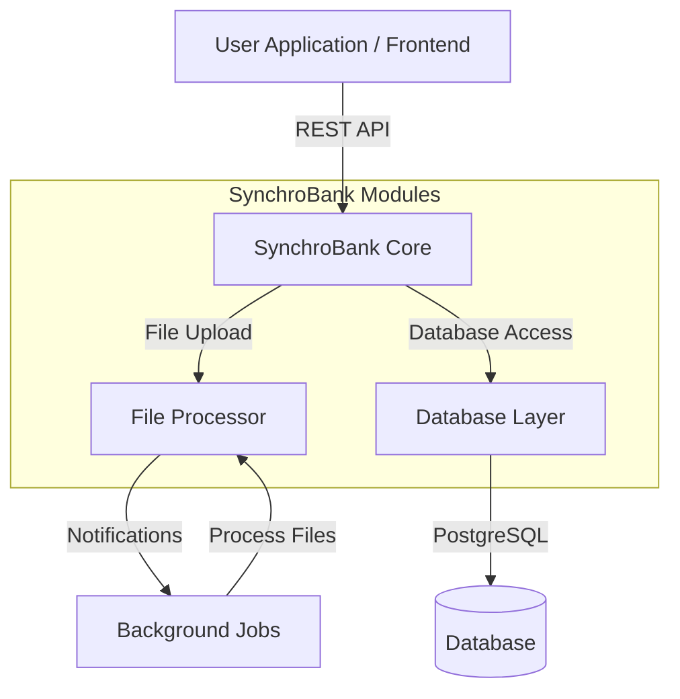
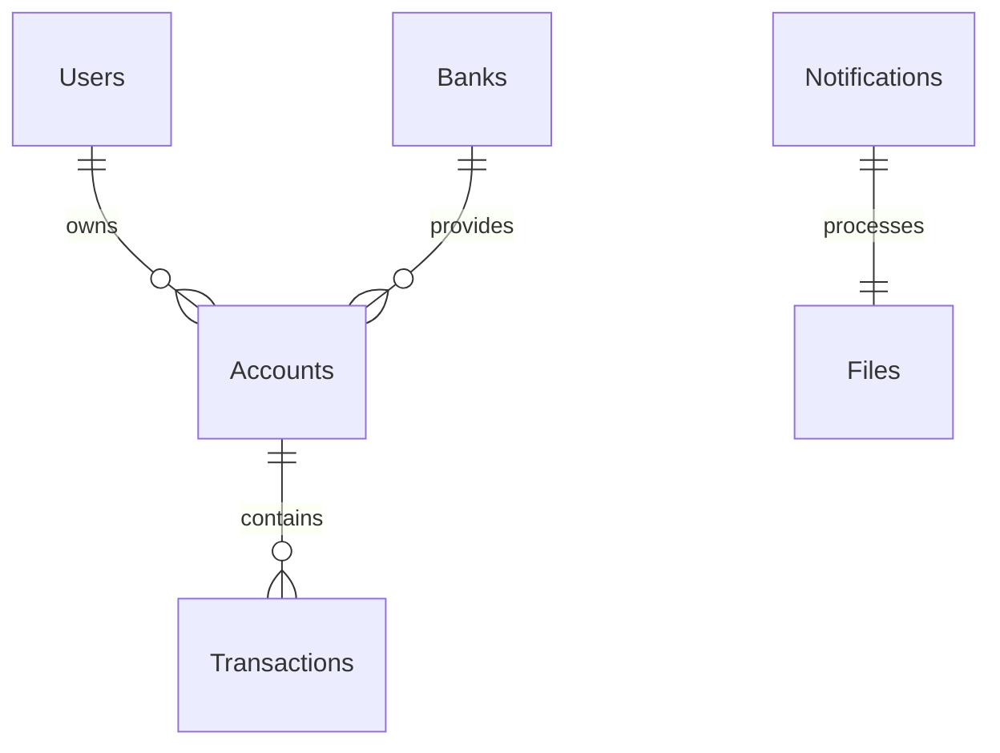

# SynchroBank

A robust, self-hostable service to synchronize and aggregate your financial data from multiple institutions into a single, unified interface.

## 📖 Overview

SynchroBank solves the problem of financial data fragmentation. In today's world, a person's financial life is spread across multiple checking accounts, credit cards, investment platforms, and loan providers. This project provides a powerful open-source engine to centralize all that information, offering a complete and unified view of your finances.

**For Developers**: A reliable and well-documented backend service to power your next fintech application.

**For Power Users**: A secure, self-hostable alternative to commercial services like Mint or Personal Capital, giving you full control and sovereignty over your own data.

⚠️ **Disclaimer**: This project, SynchroBank, is an independent open-source tool and is not affiliated with, endorsed by, or in any way officially connected with Synchrony Bank or any of its subsidiaries or affiliates.

## ✨ Key Features

- **QIF File Import**: Upload and process QIF (Quicken Interchange Format) files for transaction data
- **Automated Transaction Processing**: Background job system for processing uploaded financial data
- **RESTful API**: Clean, well-documented API to access your unified financial data
- **Multi-Module Architecture**: Modular design with clear separation of concerns
- **Docker-Powered Deployment**: Get up and running in minutes with a single docker-compose command
- **Database Schema Management**: Automated database migrations with Liquibase
- **Comprehensive Testing**: Unit and integration tests with TestContainers

## 🏗️ Architecture Overview



### Module Structure

```
synchrobank/
├── synchro-bank-core/          # Main application & REST controllers
├── synchro-bank-domain/        # Domain models and business logic
├── infra-database/             # Database entities & repositories
├── infra-files-processor/      # File processing & background jobs
└── local-environment/          # Development setup & Docker configs
```

## 🛠️ Tech Stack

### Core Technologies
- **Java 21** - Modern Java with latest features
- **Spring Boot 3.5.3** - Main application framework
- **Spring Data JPA** - Database abstraction layer
- **PostgreSQL** - Primary database
- **Maven** - Build tool and dependency management
- **Liquibase** - Database schema versioning
- **Docker** - Containerization and local development

### Key Libraries
- **Lombok** - Reduces boilerplate code
- **MapStruct** - Object mapping
- **Vavr** - Functional programming utilities
- **TestContainers** - Integration testing
- **JUnit 5 & Mockito** - Testing framework

## 🚀 Getting Started

### Prerequisites

Ensure you have the following tools installed before you begin:

- **Java 21+** (if building from source)
- **Apache Maven** (if building from source)
- **Docker and Docker Compose**

### Installation

#### 1. Using Docker (Recommended)

This is the quickest and easiest way to get SynchroBank running.

```bash
# Clone the repository
git clone https://github.com/arepresas/synchrobank.git
cd synchrobank

# Start the services
cd local-environment/docker-local-synchro-bank
docker-compose up -d
```

The API will be available at [http://localhost:1080](http://localhost:1080).

**Services Started:**
- **SynchroBank API**: Port 1080
- **PostgreSQL Database**: Port 1032
- **Liquibase**: Automatic schema setup

#### 2. Building from Source

If you prefer to build the project manually:

```bash
# Ensure you meet the Java and Maven prerequisites
# Set up the necessary environment variables (see Configuration section)

# Build the project and run tests
mvn clean install

# Run the application
java -jar synchro-bank-core/target/synchro-bank-core-0.0.1-SNAPSHOT.jar
```

### Quick Test

Upload a QIF file to test the system:

```bash
curl -X POST -F "file=@local-environment/bruno-collections/sample.qif" \
     http://localhost:1080/api/files/uploadQif
```

## ⚙️ Configuration

### Environment Variables

For production deployment, configure these environment variables:

```bash
# Database Configuration
DB_HOST=localhost
DB_PORT=5432
DB_USER=synchro-bank-user
DB_PASSWORD=synchro-bank-password

# Application Configuration
SERVER_PORT=8080
```

### Configuration Files

- **`application.yml`**: Production configuration
- **`application-local.yml`**: Local development configuration (pre-configured for Docker setup)

### Database Setup

The application uses **Liquibase** for database schema management:

- Schema definitions: `infra-database/src/main/resources/db/changeLog.xml`
- Automatic migration on startup
- Version-controlled database changes

## 📊 Database Schema

### Core Entities

- **Users**: User account management
- **Banks**: Financial institution information
- **Accounts**: User bank accounts linked to institutions
- **Transactions**: Individual financial transactions
- **Notifications**: Async processing queue for file uploads

### Entity Relationships



## 🔄 File Processing Workflow

1. **Upload**: User uploads QIF file via `/api/files/uploadQif` endpoint
2. **Queue**: System creates notification entity with `PENDING` status
3. **Process**: Background job (runs every minute) processes pending notifications
4. **Parse**: QIF file is parsed and transactions are extracted
5. **Store**: Transactions are saved to database
6. **Complete**: Notification status updated to `SENT` or `FAILED`

## 🧪 Testing

### Running Tests

```bash
# Run all tests
mvn test

# Run specific module tests
mvn test -pl synchro-bank-core

# Run integration tests
mvn verify
```

### API Testing

Use the provided Bruno collections for API testing:

```bash
# Bruno collections location
local-environment/bruno-collections/SynchroBankAPI/
```

## 👨‍💻 Development & Contribution

### Development Setup

1. **IDE Setup**: Use IntelliJ IDEA or VS Code with Java and Maven support
2. **Import Project**: Import as Maven project
3. **Code Style**: Use configurations in `local-environment/codestyles/`
4. **Database**: Use Docker setup for local PostgreSQL instance

### Code Conventions

- **Lombok annotations** for reducing boilerplate
- **Builder pattern** for entity creation
- **Repository pattern** with Spring Data JPA
- **Functional error handling** with Vavr's `Either` type
- **Scheduled jobs** for background processing

### Key Development Notes

⚠️ **Current Limitations**:
- **Single-user system** (no multi-tenancy yet)
- **QIF format only** (additional formats planned)
- **No authentication/authorization** (security layer planned)
- **Plaid integration** mentioned but not yet implemented

### Contributing

Interested in contributing? We welcome any help! 

1. Fork the repository
2. Create a feature branch
3. Make your changes
4. Add tests for new functionality
5. Submit a pull request

## 🔧 API Reference

### File Upload Endpoint

```http
POST /api/files/uploadQif
Content-Type: multipart/form-data

Parameters:
- file: QIF file to upload
```

**Response:**
```json
{
  "message": "File processed successfully: filename.qif"
}
```

### Health Check

The application runs on:
- **Local Development**: `http://localhost:1080`
- **Production**: `http://localhost:8080`

## 🐳 Docker Configuration

### Local Development Stack

```yaml
# docker-compose.yaml includes:
services:
  synchro-bank-db:      # PostgreSQL database
  synchro-bank-liquibase: # Schema management
```

### Database Access

- **Host**: localhost
- **Port**: 1032
- **Database**: synchro-bank-database
- **User**: synchro-bank-user
- **Password**: synchro-bank-password

## 🔮 Roadmap

### Planned Features

- **Multi-user support** with authentication
- **Additional file formats** (OFX, CSV)
- **Plaid API integration** for direct bank connections
- **Transaction categorization** with machine learning
- **Web dashboard** for data visualization
- **Mobile API** support
- **Data export** capabilities

### Architecture Improvements

- **Microservices** architecture
- **Event sourcing** for transaction history
- **API rate limiting** and security
- **Caching layer** for performance
- **Monitoring and observability**

## 📜 License

This project is licensed under the MIT License. See the [LICENSE](LICENSE) file for details.

## 🙏 Acknowledgements & Contact

- Inspired by the need for open-source, user-controlled personal finance tools
- Built with modern Java and Spring Boot best practices
- Community-driven development approach

**Questions, feedback, or suggestions?** Feel free to open an issue in the repository.

---

**Project Status**: Active Development | **Version**: 0.0.1-SNAPSHOT | **Java**: 21+ | **Spring Boot**: 3.5.3